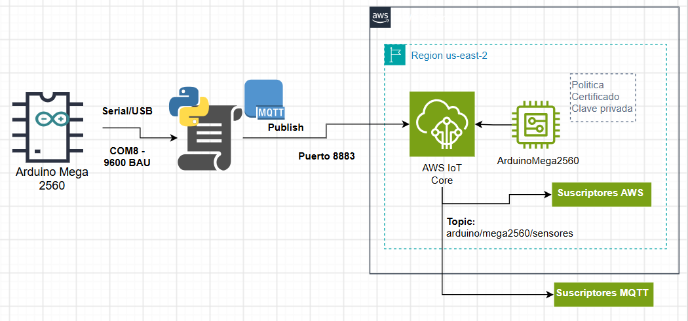
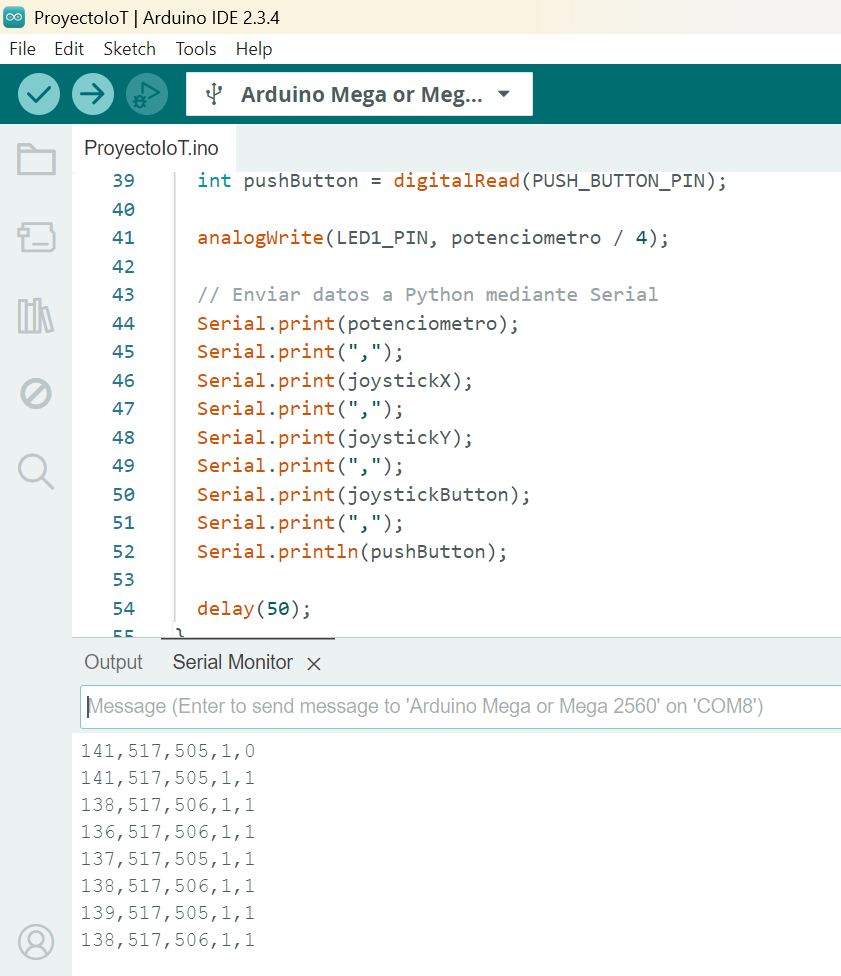
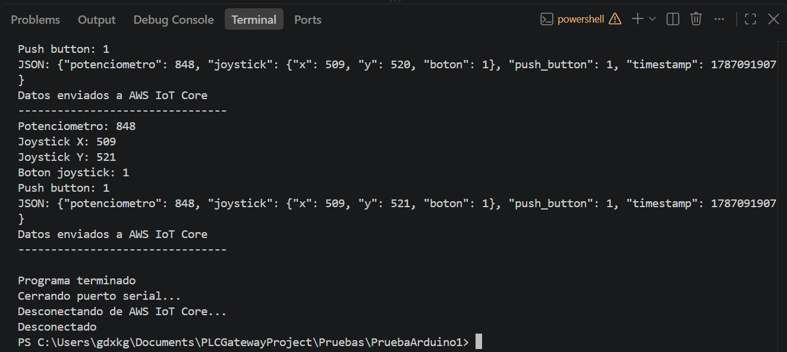
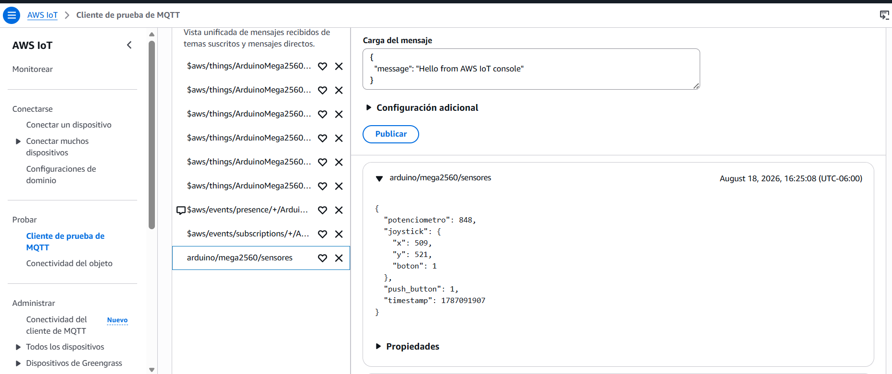

# Integración entre Python/Gateway y AWS IoT Core  

## Arquitectura


## Configuración de AWS IoT Core

* **Protocolo:** MQTT sobre TLS
* **Región AWS:** `us-east-2` — Ohio
* **Endpoint:** Device Data Endpoint de AWS IoT Core configurado para la cuenta.
* **Client ID:** `ArduinoMega2560`
* **Puerto MQTT seguro:** `8883`
* **Tópico:** `arduino/mega2560/sensores`
* **QoS:** `AT_LEAST_ONCE` (QoS 1)
* **Clean session:** `False`
* **Keep alive:** `30 segundos`
* **Autenticación:** Certificado X.509, clave privada y Amazon Root CA.

## Configuración del Gateway

### Python
Se desarrolló un programa en Python encargado de funcionar como Gateway entre el Arduino Mega 2560 y AWS IoT Core.

El Gateway realiza las siguientes funciones:

* Establece comunicación serial con el Arduino.
* Recibe y procesa las variables generadas por el dispositivo.
* Valida y convierte los datos recibidos.
* Estructura la información en formato JSON.
* Establece una conexión MQTT segura con AWS IoT Core.
* Publica los datos en el tópico MQTT configurado.
* Gestiona errores durante la lectura de datos.
* Cierra correctamente las conexiones al finalizar la ejecución.

### Librerías utilizadas
El Gateway utiliza las siguientes librerías:

|Librería |Función|
|--|--|
|serial|	Establecer y gestionar la comunicación serial con el Arduino mediante |PySerial.
|json	|Convertir las estructuras de datos de Python a formato JSON para su publicación mediante MQTT.
|time	|Generar la marca de tiempo asociada a cada lectura.
|awscrt.mqtt	| Proporcionar las funcionalidades MQTT del AWS IoT Device SDK para Python v2.
|awsiot.mqtt_connection_builder	| Construir la conexión MQTT segura mediante certificados X.509.
### Puerto COM
La comunicación entre el Arduino Mega 2560 y el Gateway Python se realiza mediante una conexión serial USB.

El puerto configurado durante las pruebas fue:

```
COM8
```

En Python se configura mediante:
```Python
PUERTO_ARDUINO = "COM8"
```
La conexión serial se inicializa de la siguiente manera:
```python
arduino = serial.Serial(
    PUERTO_ARDUINO,
    BAUD_RATE,
    timeout=1
)
```
El parámetro `timeout=1` establece un tiempo máximo de espera de un segundo para la lectura serial.

### Baud rate
La velocidad de comunicación utilizada entre el Arduino y Python fue:
```
9600 baudios
```
La configuración se establece mediante:
```
BAUD_RATE = 9600
```
Es necesario que el Arduino y Python utilicen la misma velocidad de comunicación para garantizar la correcta interpretación de los datos transmitidos.
### Formato recibido del Arduino
El Arduino transmite las variables mediante una cadena de texto cuyos valores están separados por comas.

El formato esperado es:
```
potenciometro,joystick_x,joystick_y,boton_joystick,push_button
```
Por ejemplo:
```
512,498,523,1,0
```

### Parsing de los datos
Python realiza el procesamiento de la cadena recibida mediante el método split() utilizando la coma como delimitador:
```py
datos = linea.split(",")
```
Posteriormente se verifica que la cantidad de valores recibidos corresponda con las cinco variables esperadas:
```py
if len(datos) == 5:
```
Una vez validada la cantidad de elementos, los valores son convertidos a enteros:
```py
potenciometro = int(datos[0])
joystick_x = int(datos[1])
joystick_y = int(datos[2])
boton_joystick = int(datos[3])
push_button = int(datos[4])
```
Este proceso permite transformar los valores recibidos como texto en datos numéricos que pueden ser utilizados posteriormente para construir el mensaje JSON.
### Conversión a JSON
Una vez procesados los datos, Python construye un diccionario que representa la estructura del mensaje que será enviado a AWS IoT Core.

La estructura implementada es:
```py
mensaje = {
    "potenciometro": potenciometro,


    "joystick": {
        "x": joystick_x,
        "y": joystick_y,
        "boton": boton_joystick
    },


    "push_button": push_button,


    "timestamp": int(time.time())
}
```
Posteriormente, el diccionario es convertido a una cadena JSON mediante:
```py
mensaje_json = json.dumps(mensaje)
```

### Publicación MQTT
Una vez generado el mensaje JSON, el Gateway lo publica en AWS IoT Core mediante MQTT.

El tópico configurado es:
```
arduino/mega2560/sensores
```
La publicación se realiza mediante:
```py
mqtt_connection.publish(
    topic=TOPIC,
    payload=mensaje_json,
    qos=mqtt.QoS.AT_LEAST_ONCE
)
```
La configuración utiliza `QoS 1 (AT_LEAST_ONCE)`, que proporciona una garantía de entrega de al menos una vez. Como consecuencia, un mensaje puede ser entregado más de una vez en determinadas condiciones, por lo que los consumidores deben considerar la posibilidad de duplicados.

La comunicación MQTT se establece mediante TLS, utilizando:

* Endpoint de AWS IoT Core.
* Certificado X.509 del dispositivo.
* Clave privada.
* Amazon Root CA.
* Client ID ArduinoMega2560.

### Manejo de errores
El Gateway contempla errores asociados al procesamiento de los datos recibidos desde el Arduino.

Cuando un valor recibido no puede convertirse correctamente a un entero, se genera una excepción ValueError.

El programa captura esta excepción mediante:
```py
except ValueError:
    print(
        "Datos inválidos recibidos del Arduino:",
        linea
    )
```
De esta manera, una lectura inválida no provoca la terminación inmediata del programa y permite continuar procesando las siguientes lecturas.

También se verifica que la cantidad de valores recibidos sea exactamente cinco:
```py
if len(datos) == 5:
```
Las líneas que no cumplen esta condición no son procesadas como datos válidos.

#### Limitaciones actuales

El manejo de errores implementado corresponde principalmente a la etapa de adquisición y parsing de datos. Como mejoras posteriores se contempla incorporar:

* Manejo específico de desconexión del puerto serial.
* Reconexión automática del puerto serial.
* Manejo de pérdida de conexión MQTT.
* Reconexión automática con AWS IoT Core.
* Registro estructurado de errores.
* Validación de rangos de las variables.
* Manejo de mensajes MQTT no publicados correctamente.

### Desconexión
El programa contempla un cierre controlado de las conexiones cuando se interrumpe su ejecución mediante KeyboardInterrupt.

La estructura utilizada es:
```py
except KeyboardInterrupt:


    print("\nPrograma terminado")


finally:


    print("Cerrando puerto serial...")


    arduino.close()


    print("Desconectando de AWS IoT Core...")


    disconnect_future = mqtt_connection.disconnect()


    disconnect_future.result()


    print("Desconectado")
```
El bloque finally garantiza que se intente cerrar tanto la conexión serial con el Arduino como la conexión MQTT con AWS IoT Core.

### Estructura del mensaje

Esto es especialmente importante:

```json
{
  "potenciometro": 512,
  "joystick": {
    "x": 498,
    "y": 523,
    "boton": 1
  },
  "push_button": 0,
  "timestamp": 1750000000
}
```

## Seguridad

La comunicación entre el Gateway desarrollado en Python y AWS IoT Core se implementa utilizando MQTT sobre TLS, complementado con autenticación mediante certificados digitales. Este mecanismo permite proteger la comunicación y controlar el acceso del Gateway a los recursos de AWS IoT Core.

### Autenticación mediante certificados X.509

El Gateway utiliza autenticación basada en certificados X.509 para establecer la conexión con AWS IoT Core.

Para la conexión se utilizan los siguientes elementos:

|Elemento	|Función|
|--|--|
|Certificado X.509	|Identifica y autentica al cliente MQTT ante AWS IoT Core.
|Clave privada	|Permite demostrar la posesión del certificado y establecer la conexión segura.
|Amazon Root CA|	Permite verificar la cadena de confianza del certificado del servidor.
|Endpoint de AWS IoT Core|	Identifica el Device Gateway al que se conecta el cliente.
|Client ID	|Identifica la sesión MQTT del cliente.

La configuración utilizada en Python es:
```py
mqtt_connection = mqtt_connection_builder.mtls_from_path(
    endpoint=AWS_ENDPOINT,


    cert_filepath=PATH_CERTIFICATE,
    pri_key_filepath=PATH_PRIVATE_KEY,


    ca_filepath=PATH_ROOT_CA,


    client_id=CLIENT_ID,


    clean_session=False,


    keep_alive_secs=30
)
```
El método `mtls_from_path()` configura una conexión `mTLS (Mutual TLS)`, en la que se utiliza el certificado del cliente para autenticarse y la autoridad certificadora para validar el certificado presentado por el servidor.

### Cifrado de la comunicación

La comunicación MQTT entre Python y AWS IoT Core utiliza TLS, evitando que los mensajes sean transmitidos en texto plano durante el transporte.

La arquitectura de seguridad de la comunicación es:
```
Python Gateway
     │
     │ Certificado X.509
     │ + Clave privada
     │
     │ MQTT sobre TLS
     ▼
AWS IoT Core
     │
     │ Validación de certificado
     ▼
Device Gateway
```
El uso de TLS proporciona confidencialidad e integridad durante la transmisión de los datos.

### Política de AWS IoT Core

Se creó una política denominada:

>ArduinoMega2560Policy

Durante las pruebas, la política permitió las operaciones MQTT necesarias para validar la comunicación:

* iot:Connect
* iot:Publish
* iot:Subscribe
* iot:Receive

La política utilizada durante la etapa de desarrollo fue de carácter amplio para facilitar las pruebas iniciales.

>**Consideración de seguridad:** La política utilizada durante el prototipo debe ser restringida antes de utilizarse en un entorno de producción. Se recomienda aplicar el principio de mínimo privilegio, limitando las acciones y recursos únicamente a los necesarios para el funcionamiento del dispositivo.

### Relación entre Thing, certificado y política

Dentro de AWS IoT Core se creó el Thing:

>ArduinoMega2560

El Thing representa el dispositivo dentro del inventario de AWS IoT Core y puede asociarse con su certificado de dispositivo.

La relación conceptual utilizada es:
```
ArduinoMega2560
       │
       │ representa
       ▼
    Dispositivo
       │
       │ asociado a
       ▼
Certificado X.509
       │
       │ autorizado mediante
       ▼
ArduinoMega2560Policy
```
Es importante distinguir estos elementos:

* **Thing:** representa y permite administrar el dispositivo dentro de AWS IoT Core.
* **Certificado:** proporciona la identidad criptográfica utilizada para autenticar la conexión.
* **Política:** determina qué operaciones puede realizar el cliente autenticado.
* **Client ID:** identifica la sesión MQTT establecida por el cliente.

### Protección de credenciales

Los archivos utilizados para la autenticación contienen información sensible y nunca deben incluirse en la documentación pública ni en repositorios de código.

Entre los archivos que deben protegerse se encuentran:
```
certificate.pem.crt
private.pem.key
```
La clave privada debe mantenerse protegida y con permisos de acceso restringidos.

El código fuente solamente debe contener las rutas de los archivos de credenciales, evitando incluir directamente el contenido de los certificados o claves privadas.

Ejemplo:
```py
PATH_CERTIFICATE = "certificados/certificate.pem.crt"
PATH_PRIVATE_KEY = "certificados/private.pem.key"
PATH_ROOT_CA = "certificados/AmazonRootCA1.pem"
```
>**Importante:** Los archivos que contienen claves privadas y certificados de autenticación no deben subirse a repositorios públicos, incluirse en capturas de pantalla ni compartirse mediante canales no autorizados.


## Prueba de funcionamiento

1. Arduino genera datos.
2. Python recibe datos por COM8.
3. Python transforma los datos a JSON.
4. Python publica mediante MQTT.
5. AWS IoT Core recibe el mensaje.
6. Un cliente MQTT suscrito al tópico recibe el mensaje.
7. Se verifica la recepción en tiempo real.






>**Estado actual:** El Gateway implementa correctamente la adquisición de datos seriales, transformación a JSON y publicación mediante MQTT/TLS hacia AWS IoT Core. El manejo de reconexiones automáticas y tolerancia ante fallos de comunicación se considera una mejora pendiente para las siguientes etapas del prototipo.