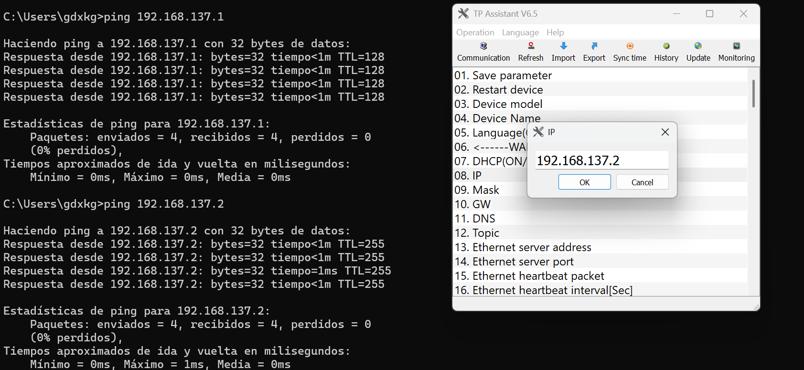
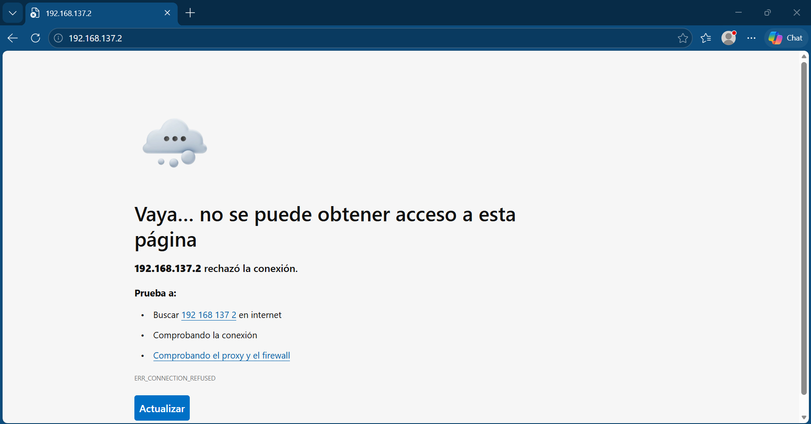
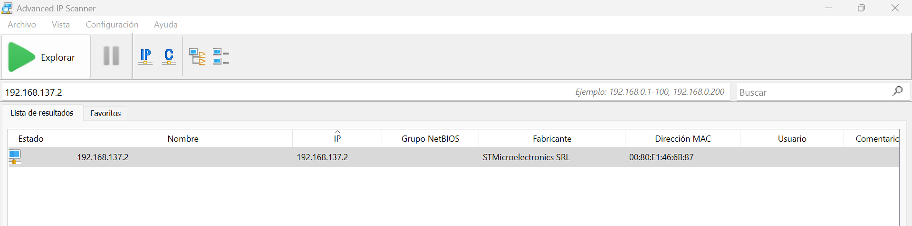
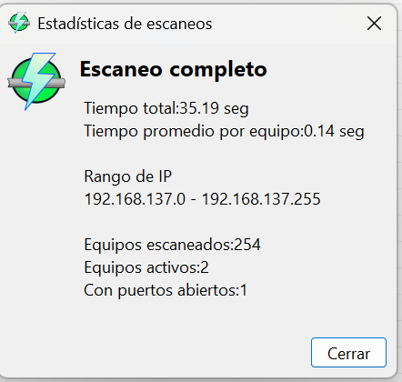
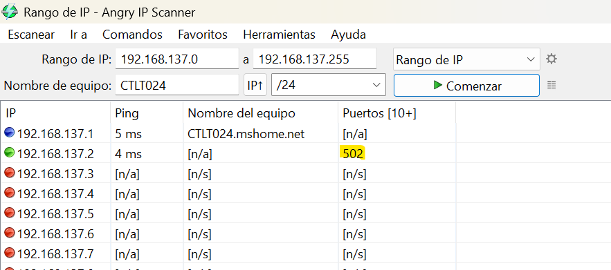
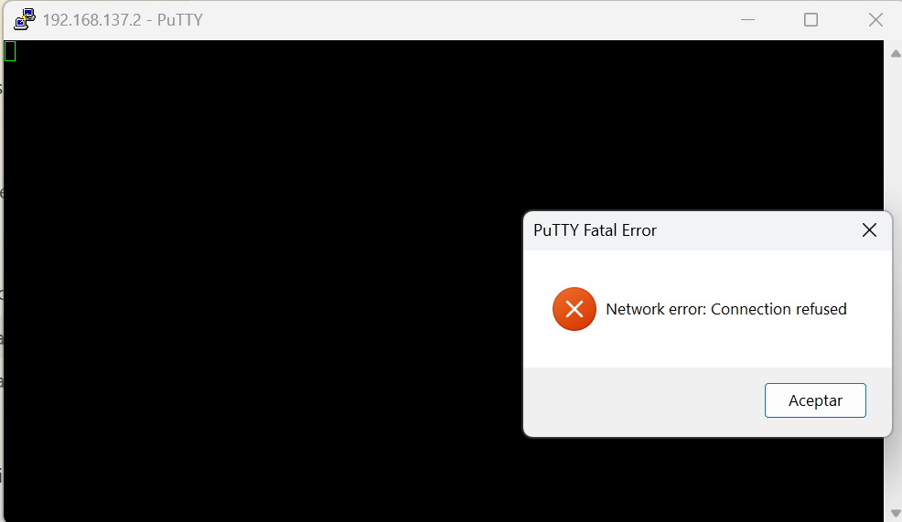
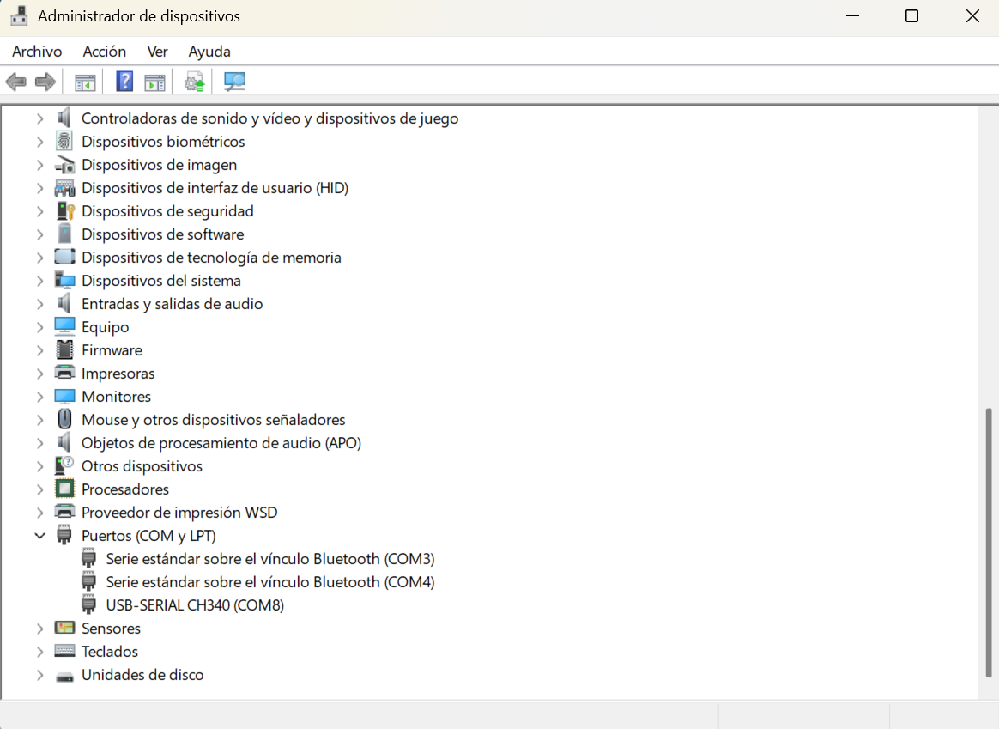
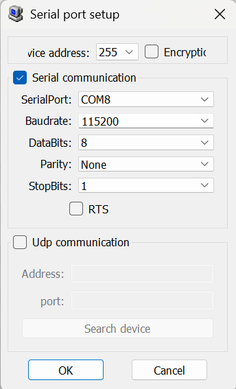
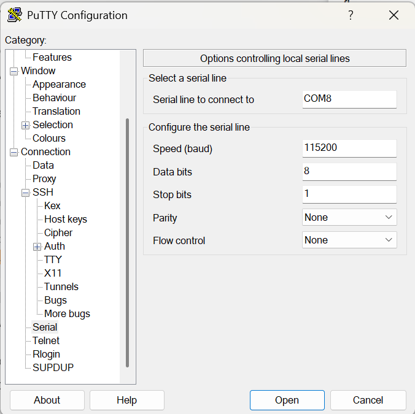
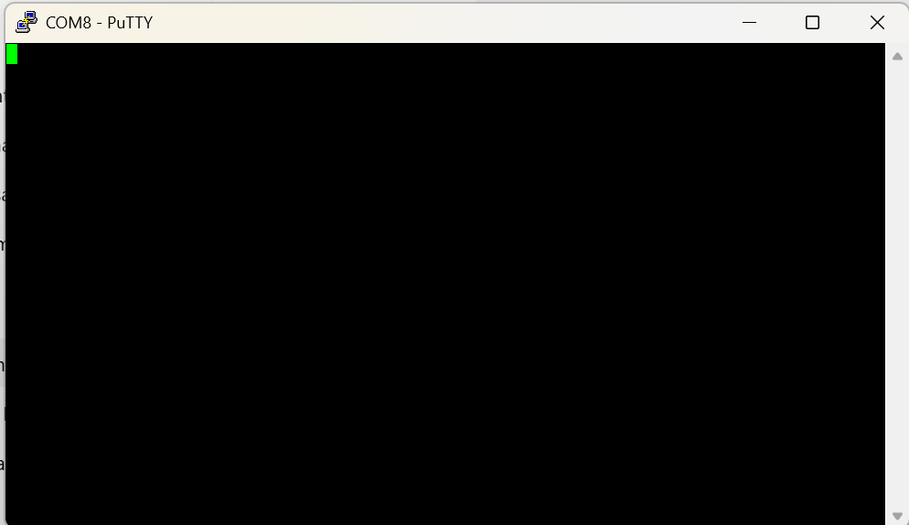

# Identificación de mecanismos de acceso y administración del gateway
## Objetivo
```
Identificar y validar mecanismos de acceso al gateway a través de pruebas de conectividad mediante Ethernet y evaluar los mecanismos disponibles para la administración y configuración del dispositivo, incluyendo acceso mediante dirección IP, interfaz web y otros métodos soportados por el fabricante.
```
## Configuración Utilizada
### Alimentación eléctrica
|Parámetro|	Configuración|
|---------|--------------|
|Alimentación|	12–24 VDC|
|Corriente máxima considerada|	< 1 A|
|Polaridad	|Positivo (+) / Negativo (–)|

### Comunicación USB
|Parámetro	|Configuración|
|-----------|-------------|
|Interfaz|	USB-C|
|Controlador|	CH340|
|Puerto COM|	COM8|
|Velocidad|	115200 baudios|
|Software|	TP Assistant 6.2|

### Configuración de red
|Dispositivo|	Dirección IP|	Máscara de subred|
|-----------|---------------|--------------------|
|Gateway|	192.168.137.2|	255.255.255.0|
|Computadora|	192.168.137.1|	255.255.255.0|

La configuración coloca ambos dispositivos dentro de la misma red 192.168.137.0/24, permitiendo establecer comunicación directa mediante Ethernet.


## Procedimiento
### Ping a IP del gateway
1. Se estableció una configuración de red para realizar pruebas de comunicación Ethernet:
    * Gateway: 192.168.137.2
    * Máscara: 255.255.255.0
    * Computadora: 192.168.137.1
2. Se guardó la configuración y se reinició el Gateway.
3. Se conectó un cable Ethernet directamente entre el Gateway y la computadora.
4. Se realizaron pruebas de conectividad mediante ping hacia la dirección IP física configurada en el Gateway: 192.168.137.2.



### Acceso HTTP/HTTPS
1. Se abrió una nueva ventana en el navegador web de Microsoft Edge.
2. Se colocó en la barra de navegación la dirección http://192.168.137.2 para intentar acceder al puerto 80 del gateway. 
3. También se probó la dirección https://192.168.137.2.



### Acceso de puertos
1. Se instaló Advance IP Scanner para poder realizar el escaneo de puertos abiertos dada la dirección IP del gateway.
2. En el menu de configuraciones se habilitaron todas las opciones de exploración de recursos.
3. Se colocó la IP del gateway.
4. Se hizo clik en el botón de explorar.



1. Se instaló Angry IP Scanner para poder realizar el escaneo de puertos abiertos dada la dirección IP del gateway.
2. En el apartado de Preferencias dentro de Herramientas se configurarón las opciones de escaneo.
    
    * Número de pruebas de ping: `3`
    * Puertos por escanear: `21, 22,23,80,443,502,1883,8080,8443,8883, 6651`
    * Todas las demás configuraciones se dejaron por defecto.
3. Se indicó el rango de IPs por escanear.
4. Se hizo clic en comenzar.



> Se identificó un puerto abierto: 502. Coreesponde a Modbus TCP.



### SSH
1. Se inicializó PuTTY.
2. Se configuró la Ip del Hots (gateway [192.168.137.2]) el puerto `22` y el tipo de conexión `SSH`.
3. Se hizo clic en abrir.



### Consola/Serial
1. Se ejecutó el administrador de dispositivos.
2. Se localizó el apartado de Puertos COM y LPT.
3. Se identificó el puerto de comunicación que Windows asignó a la conexión con el gateway.



4. Para establecer la comunicación serial se establecieron las siguientes configuraciones:



> El resultado fue exitoso y de este modo se accedió a las configuraciones del gateway.

5. Para acceder por consola se utilizó PuTTY con las siguientes configuraciones.


6. Se hizo clic en abrir.




## Registro de pruebas 

| Prueba                | Objetivo                        | Resultado |
| --------------------- | ------------------------------- | --------- |
| Ping a IP del gateway | Validar conectividad            | Exitoso   |
| Acceso HTTP/HTTPS     | Verificar interfaz web          | Denegado  |
| Acceso de puertos     | Idendtificar interfaces de acceso y comunicación  | Exitoso |
| SSH                   | Verificar acceso administrativo | Denegado  |
| Consola/serial        | Verificar acceso local          | Exitoso |
| Acceso desde otra red | Evaluar administración remota   | Pendiente |

## Conclusiones
* Se comprobó la conectividad Ethernet con el gateway mediante pruebas de ping a la dirección 192.168.137.2, confirmando que el dispositivo responde correctamente dentro de la red local configurada.
* No se obtuvo acceso administrativo a través de HTTP, HTTPS ni SSH durante las pruebas realizadas. Esto indica que el gateway no expone una interfaz web ni un servicio SSH en los puertos evaluados, o bien que dichos servicios requieren una habilitación o configuración previa.
* El escaneo identificó el puerto 502/TCP como disponible, asociado habitualmente con el protocolo Modbus TCP. Por lo tanto, este puerto representa el mecanismo de comunicación en red identificado para la integración con equipos o sistemas compatibles con Modbus TCP.
* También se identificó el puerto serial COM8, configurado a 115200 baudios y utilizado por el software TP Assistant. Aunque PuTTY logró abrir la conexión serial, no se mostró una consola interactiva; será necesario confirmar parámetros como paridad, bits de parada y control de flujo, así como determinar si el dispositivo emplea una CLI o un protocolo propietario.

En conclusión, la administración y configuración del gateway parece depender principalmente de la conexión USB/serial y del software del fabricante, mientras que la interfaz Ethernet permite conectividad IP y comunicación Modbus TCP. Queda pendiente validar el acceso desde otra red y revisar la documentación del fabricante para confirmar los mecanismos de administración remota soportados.