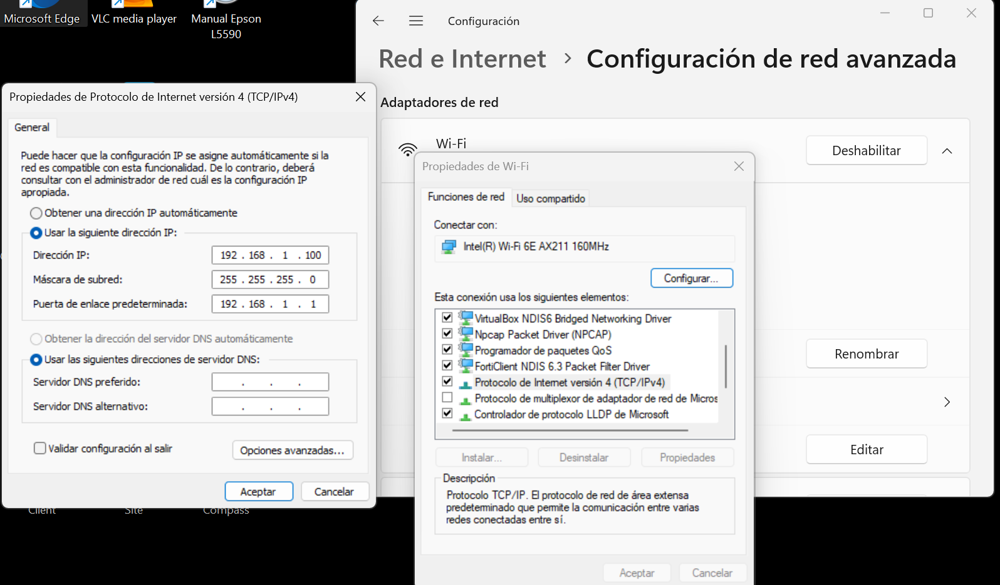
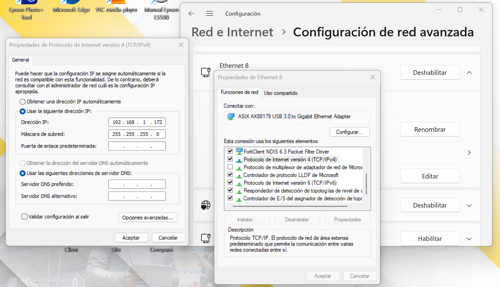
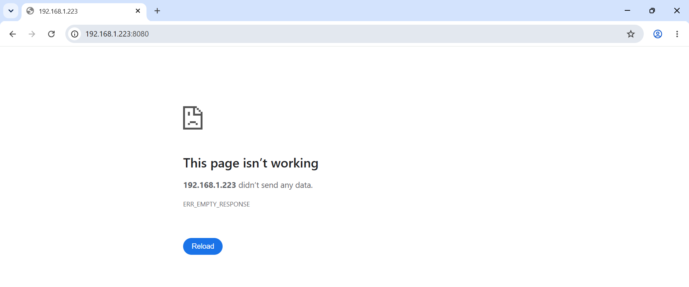
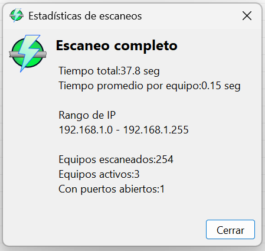
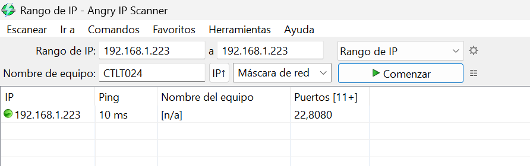
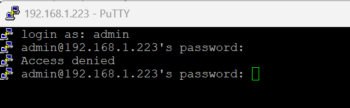

# Identificación de mecanismos de acceso y administración del gateway
## Objetivo
```
Identificar y validar mecanismos de acceso al gateway a través de pruebas de conectividad mediante Ethernet y evaluar los mecanismos disponibles para la administración y configuración del dispositivo, incluyendo acceso mediante dirección IP, interfaz web y otros métodos soportados por el fabricante.
```
## Configuración Utilizada
### Alimentación eléctrica
|Parámetro|	Configuración|
|---------|--------------|
|Alimentación|	12–24 VDC|
|Corriente máxima considerada|	< 1 A|
|Polaridad	|Positivo (+) / Negativo (–)|

### Comunicación Ethernet
|Parámetro	|Configuración|
|-----------|-------------|
|Interfaz|	USB-Ethernet  |
|Controlador|	---|
|Puerto COM|	Ethernet8 |
|Velocidad|	? |
|Software|	WinIfDesigner |

### Configuración de red
|Dispositivo|	Dirección IP|	Máscara de subred|
|-----------|---------------|--------------------|
|Gateway    |	192.168.1.223|	255.255.255.0|
|Computadora|	192.168.1.100|	255.255.255.0|
|Adaptador|	192.168.1.172|	255.255.255.0|

La configuración coloca los dispositivos dentro de la misma red 192.168.1.0/24, permitiendo establecer comunicación directa mediante Ethernet.


## Procedimiento
### Ping a IP del gateway
1. Se conectó el gateway a una fuente de 24 V.
2. Se conectó el cable ethernet T568B al puerto WAN1 y el otro extremo al XTC375 (adaptador de red USB-RJ45).
3. Se configuró manualmente la red para realizar las pruebas de comunicación:
    * Gateway: 192.168.1.223
    * Computadora: 192.168.1.100
    * Adaptador: 192.168.1.172
    * Máscara: 255.255.255.0

    Para hacerlo se siguieron los siguientes pasos:

    3.1 Entrar a Red e Internet en configuraciones.

    3.2 Ingresar a configuración avanzada.

    3.3 Dirigirse a WIFI/Ethernet 8

    3.4 Más opciones de adaptador y luego clic en editar.

    3.5 Dirigirse a Protocolo de internet TCP/IPV4 y clic en propiedades.

    3.6 Usar las IPs definidas.

    
    

4. Se guardó la configuración.
5. Se realizaron pruebas de conectividad mediante ping hacia la dirección IP física configurada en el Gateway: 192.168.137.2.


### Acceso HTTP/HTTPS
1. Se abrió una nueva ventana en el navegador web de Microsoft Edge.
2. Se colocó en la barra de navegación la dirección http://192.168.1.223 para intentar acceder al puerto 8080 del gateway. 



### Acceso de puertos
1. Se instaló Angry IP Scanner para poder realizar el escaneo de puertos abiertos dada la dirección IP del gateway.
2. En el apartado de Preferencias dentro de Herramientas se configurarón las opciones de escaneo.
    
    * Número de pruebas de ping: `3`
    * Puertos por escanear: `21, 22,23,80,443,502,1883,8080,8443,8883, 6651`
    * Todas las demás configuraciones se dejaron por defecto.
3. Se indicó el rango de IPs por escanear.
4. Se hizo clic en comenzar.



> Se identificó un puerto abierto: 8080. Corresponde a una interfaz web por lo general.



### SSH
1. Se inicializó PuTTY.
2. Se configuró la Ip del Hots (gateway [192.168.1.223]) el puerto `22` y el tipo de conexión `SSH`.
3. Se hizo clic en abrir.




## Registro de pruebas 

| Prueba                | Objetivo                        | Resultado |
| --------------------- | ------------------------------- | --------- |
| Ping a IP del gateway | Validar conectividad            | Exitoso   |
| Acceso HTTP/HTTPS     | Verificar interfaz web          | Denegado  |
| Acceso de puertos     | Idendtificar interfaces de acceso y comunicación  | Exitoso |
| SSH                   | Verificar acceso administrativo | Denegado  |
| Consola/serial        | Verificar acceso local          | Denegado  |
| Acceso desde otra red | Evaluar administración remota   | Pendiente |

## Conclusiones
* La conectividad a nivel de red con el gateway quedó validada: al ubicar la computadora, el adaptador USB-Ethernet y el gateway dentro del mismo segmento 192.168.1.0/24, la prueba de ping fue exitosa, confirmando que el dispositivo responde correctamente por su interfaz Ethernet cuando la configuración de red es correcta.
* El escaneo de puertos con Angry IP Scanner permitió identificar el puerto 8080 como el único puerto abierto entre los evaluados (21, 22, 23, 80, 443, 502, 1883, 8080, 8443, 8883 y 6651). Esto sugiere que el dispositivo expone una interfaz de administración web en un puerto no estándar, en lugar del puerto 80/443 convencional.
* A pesar de detectarse el puerto 8080 como abierto, el acceso HTTP/HTTPS directo mediante navegador fue denegado, lo que indica que la disponibilidad del puerto no garantiza acceso administrativo sin credenciales, un método de acceso distinto (por ejemplo, HTTPS con certificado, una ruta específica, o una capa de autenticación previa) o una configuración adicional aún no identificada.
* El acceso por SSH (puerto 22) y por consola/serial fue denegado, lo que descarta —al menos con la configuración y credenciales probadas— estas dos vías como mecanismos disponibles de administración del gateway.
* La evaluación de administración remota desde otra red quedó pendiente y debe abordarse en una siguiente etapa para determinar si el gateway permite gestión fuera del segmento local o si su administración está restringida exclusivamente a acceso local por diseño o por configuración de fábrica.
* En conjunto, los resultados muestran que el gateway es accesible y responde a nivel de red, pero que sus mecanismos de administración remota (web, SSH, consola) se encuentran restringidos con la configuración actual. Se recomienda como próximo paso consultar la documentación del fabricante para identificar el método de acceso correcto al puerto 8080 (credenciales por defecto, protocolo esperado, o requisitos previos de configuración) y completar la prueba de acceso desde otra red.